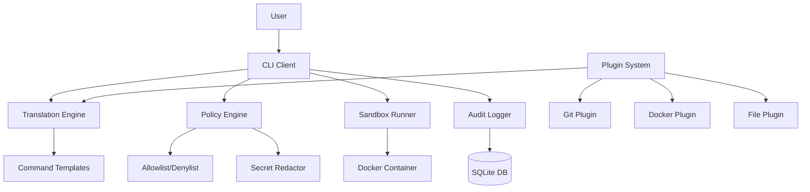
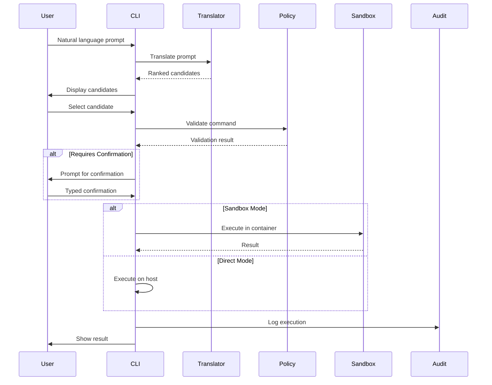

# QuickCMD Architecture

## Overview

QuickCMD is a developer-safe CLI assistant that translates natural language into shell commands with comprehensive safety features, policy enforcement, and audit logging.

## System Components



## Core Components

### 1. Translation Engine (`core/translator/`)

Converts natural language prompts into shell commands using a template-based pattern matching system.

**Key Features:**
- Regex-based pattern matching against command templates
- Confidence scoring (0-100) based on match quality and keyword presence
- Risk classification (Safe, Medium, High)
- Step-by-step command breakdown for explainability
- Returns top 3 ranked candidates

**Template Structure:**
```go
type Template struct {
    Patterns    []*regexp.Regexp  // Patterns to match
    Generator   func([]string) *Candidate
    Keywords    []string          // Boost confidence
    Category    string            // git, docker, file, etc.
}
```

**Built-in Templates:**
- File operations (find, delete, archive)
- Git operations (status, commit)
- Docker operations (cleanup, prune)
- System operations (disk usage)
- Search operations (find TODOs)

### 2. Policy Engine (`core/policy/`)

Enforces security policies through allowlist/denylist pattern matching and approval requirements.

**Key Features:**
- YAML-based policy configuration
- Regex pattern matching for command validation
- Typed confirmation prompts for high-risk operations
- Secrets redaction for sensitive data
- Configurable approval workflows

**Policy Hierarchy:**
1. **Denylist** (highest priority) - blocks dangerous commands
2. **Allowlist** (if defined) - only allows matching commands
3. **Approval Rules** - requires confirmation based on risk/destructiveness

**Default Blocked Patterns:**
- `rm -rf /` - root deletion
- Fork bombs
- System shutdown/reboot
- Filesystem formatting
- Piping curl/wget to shell

### 3. Sandbox Runner (`core/sandbox/`)

Executes commands in isolated Docker containers with resource limits.

**Features:**
- Ephemeral containers (created and destroyed per execution)
- Resource limits (CPU, memory, time)
- Network isolation (disabled by default)
- Read-only mounts (configurable)
- Pre-run snapshots for Git repositories

**Execution Modes:**
- **Dry-run** (default) - show commands without executing
- **Sandbox** - execute in isolated container
- **Direct** - execute on host (requires explicit confirmation)

### 4. Audit Logger (`core/audit/`)

Records all command executions in an append-only SQLite database.

**Logged Information:**
- Timestamp
- User
- Original prompt
- Executed command
- Sandbox ID
- Exit code
- stdout/stderr (with secrets redacted)
- Risk level
- Undo strategy (if available)

### 5. Plugin System (`core/plugins/`)

Extensible plugin architecture for domain-specific command handling.

**Plugin Interface:**
```go
type Plugin interface {
    Name() string
    Patterns() []string
    Translate(prompt string) ([]Candidate, error)
    Validate(cmd string) error
}
```

**Built-in Plugins:**
- **Git Plugin** - automatic backup branches, PR generation
- **Docker Plugin** - container management, cleanup
- **File Plugin** - safe file operations with dry-run

## CLI Architecture

### Command Flow



### CLI Commands

- `quickcmd [prompt]` - translate and optionally execute
- `quickcmd run [prompt]` - explicit run command
- `quickcmd history` - view audit log
- `quickcmd version` - show version info

### Flags

- `--dry-run` - show commands without executing (default)
- `--sandbox` - execute in isolated container
- `--yes` - skip confirmations (dangerous!)
- `--config` - custom config file path
- `--verbose` - detailed output

## Security Model

### Defense in Depth

1. **Input Validation** - pattern matching against known templates
2. **Policy Enforcement** - allowlist/denylist validation
3. **Confirmation Prompts** - typed confirmation for high-risk ops
4. **Sandbox Isolation** - containerized execution
5. **Audit Logging** - complete traceability
6. **Secrets Redaction** - automatic redaction of sensitive data

### Threat Model

**Protected Against:**
- Accidental destructive commands
- Malicious command injection (via denylist)
- Privilege escalation (via sandbox)
- Credential leakage (via redaction)

**NOT Protected Against:**
- Intentional malicious use by authorized users
- Container escape vulnerabilities
- Social engineering attacks

### Security Boundaries

```
┌─────────────────────────────────────┐
│           User Input                │
└──────────────┬──────────────────────┘
               │
               ▼
┌─────────────────────────────────────┐
│      Translation Engine             │
│  (Pattern Matching, Templates)      │
└──────────────┬──────────────────────┘
               │
               ▼
┌─────────────────────────────────────┐
│        Policy Engine                │
│  (Allowlist/Denylist, Approval)     │
└──────────────┬──────────────────────┘
               │
               ▼
┌─────────────────────────────────────┐
│      Sandbox Container              │
│  (Isolated, Resource Limited)       │
└─────────────────────────────────────┘
```

## Data Flow

### Configuration Files

- `~/.quickcmd/config.yaml` - user configuration
- `~/.quickcmd/policy.yaml` - security policy
- `~/.quickcmd/audit.db` - audit log database

### Environment Variables

- `QUICKCMD_CONFIG` - override config file location
- `QUICKCMD_POLICY` - override policy file location
- `QUICKCMD_SANDBOX_ENABLED` - enable/disable sandbox

## Extension Points

### Adding Custom Templates

```go
translator.AddTemplate(&Template{
    Patterns: []*regexp.Regexp{
        regexp.MustCompile(`your pattern here`),
    },
    Category: "custom",
    Generator: func(matches []string) *Candidate {
        return &Candidate{
            Command: "your command",
            // ... other fields
        }
    },
})
```

### Creating Plugins

Implement the `Plugin` interface and register with the plugin system.

### Custom Policies

Create YAML policy files with custom allowlist/denylist patterns.

## Performance Considerations

- **Translation**: O(n) where n = number of templates (typically < 100)
- **Policy Validation**: O(m) where m = number of patterns (typically < 50)
- **Sandbox Startup**: ~1-2 seconds for container creation
- **Audit Logging**: Append-only writes, minimal overhead

## Future Enhancements

- **LLM Integration** - OpenAI/Anthropic for advanced translation
- **Web UI** - Browser-based interface with approval workflows
- **Remote Agent** - Execute commands on remote servers
- **Kubernetes Plugin** - K8s-specific operations
- **AWS Plugin** - Infrastructure operations with cost estimates
- **Multi-party Approval** - Team-based approval workflows
