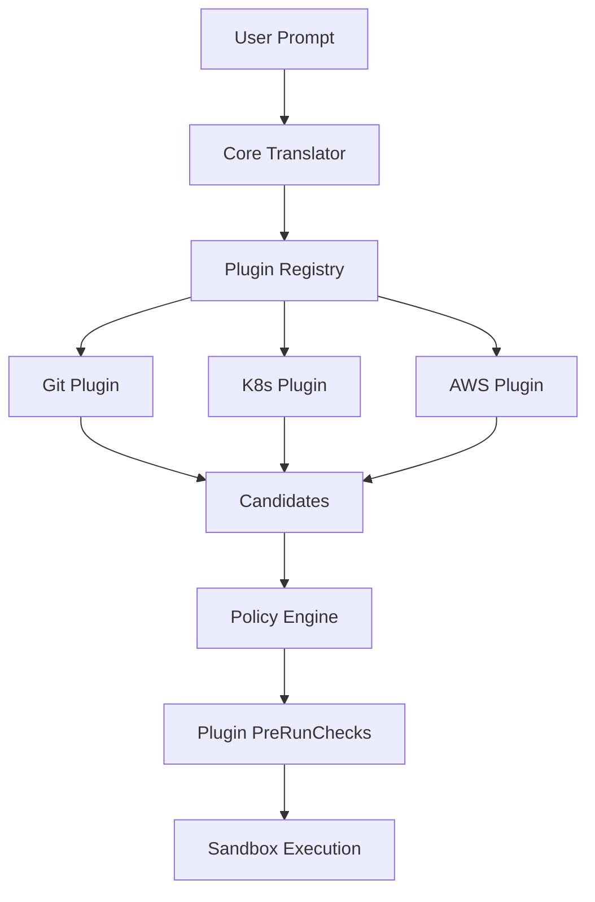

# QuickCMD Plugin System

## Overview

QuickCMD's plugin system allows domain-specific translators, safety checks, and metadata to be added without modifying core code. Plugins can enhance natural language translation, add custom safety rules, and provide specialized functionality for different tools and platforms.

## Architecture



## Plugin Interface

All plugins must implement the `Plugin` interface:

```go
type Plugin interface {
    // Name returns the unique name of the plugin
    Name() string
    
    // Translate attempts to translate a prompt into command candidates
    Translate(ctx Context, prompt string) ([]*Candidate, error)
    
    // PreRunCheck performs safety checks before execution
    PreRunCheck(ctx Context, candidate *Candidate) (*CheckResult, error)
    
    // RequiresApproval returns true if candidate requires approval
    RequiresApproval(candidate *Candidate) bool
    
    // Scopes returns required scopes/permissions
    Scopes() []string
}
```

## Built-in Plugins

### Git Plugin

Handles Git operations with automatic backup branches and safety checks.

**Features:**
- Automatic backup branch creation for destructive operations
- Detection of uncommitted changes
- Force push protection
- Undo strategy generation

**Example Prompts:**
```bash
"create backup branch and commit changes"
"commit all changes with message 'Fix bug'"
"revert last commit"
"delete branch old-feature"
```

**Safety Checks:**
- Requires approval for destructive operations
- Warns about uncommitted changes
- Requires typed confirmation for force operations

### Kubernetes Plugin

Translates kubectl commands with RBAC awareness and cluster state protection.

**Features:**
- kubectl command generation
- RBAC permission hints
- Cluster state change detection
- Namespace support

**Example Prompts:**
```bash
"scale deployment api to 5 replicas"
"get pods in namespace production"
"delete pod nginx-123"
"apply manifest deployment.yaml"
```

**Safety Checks:**
- All cluster-altering operations require approval
- RBAC context included in metadata
- Destructive operations flagged as high-risk

### AWS Plugin

AWS CLI operations with cost estimation and credential protection.

**Features:**
- AWS CLI command generation
- Cost estimation heuristics
- Credential sanitization
- Scoped credential requirements

**Example Prompts:**
```bash
"list ec2 instances"
"increase asg my-asg to 5"
"create s3 bucket my-bucket"
"describe cloudformation stack my-stack"
```

**Safety Checks:**
- Cost threshold enforcement (default: $10/hour)
- Credential parameter detection and blocking
- Resource-creating operations require approval

## Creating a Custom Plugin

### Step 1: Implement the Plugin Interface

```go
package myplugin

import "github.com/yourusername/quickcmd/core/plugins"

type MyPlugin struct{}

func (p *MyPlugin) Name() string {
    return "myplugin"
}

func (p *MyPlugin) Translate(ctx plugins.Context, prompt string) ([]*plugins.Candidate, error) {
    // Your translation logic here
    return nil, nil
}

func (p *MyPlugin) PreRunCheck(ctx plugins.Context, candidate *plugins.Candidate) (*plugins.CheckResult, error) {
    return &plugins.CheckResult{Allowed: true}, nil
}

func (p *MyPlugin) RequiresApproval(candidate *plugins.Candidate) bool {
    return false
}

func (p *MyPlugin) Scopes() []string {
    return []string{"myplugin:read", "myplugin:write"}
}
```

### Step 2: Register the Plugin

```go
func init() {
    plugin := &MyPlugin{}
    metadata := &plugins.PluginMetadata{
        Name:        "myplugin",
        Version:     "1.0.0",
        Description: "My custom plugin",
        Author:      "Your Name",
        Scopes:      []string{"myplugin:read", "myplugin:write"},
        Enabled:     true,
    }
    
    plugins.Register(plugin, metadata)
}
```

### Step 3: Import in Main

```go
import (
    _ "github.com/yourusername/quickcmd/plugins/myplugin"
)
```

## Plugin Lifecycle

### Registration

Plugins are registered during initialization:

```go
plugins.Register(plugin, metadata)
```

### Translation Flow

1. User provides natural language prompt
2. Core translator generates candidates
3. **Plugin hook: PreTranslate**
4. Each enabled plugin attempts translation
5. Plugin candidates are merged with core candidates
6. **Plugin hook: PostTranslate**
7. Candidates are ranked by confidence

### Pre-Run Check Flow

1. User selects a candidate
2. Policy engine validates against denylist
3. **Plugin PreRunCheck is called**
4. Plugin can:
   - Deny execution
   - Require approval
   - Add metadata
5. Combined result determines execution

### Execution Flow

1. **Plugin hook: PreExecution**
2. Command executes in sandbox
3. **Plugin hook: PostExecution**
4. **Plugin hook: AuditMetadata** (for audit log)

## Plugin Hooks

### Pre-Translate Hook

Called before translation begins:

```go
plugins.DefaultRegistry().RegisterHook(plugins.HookPreTranslate, func(ctx plugins.Context, data interface{}) error {
    hookData := data.(*plugins.TranslateHookData)
    // Modify prompt or candidates
    return nil
})
```

### Post-Translate Hook

Called after all plugins have translated:

```go
plugins.DefaultRegistry().RegisterHook(plugins.HookPostTranslate, func(ctx plugins.Context, data interface{}) error {
    hookData := data.(*plugins.TranslateHookData)
    // Filter or modify candidates
    return nil
})
```

### Pre-Execution Hook

Called before sandbox execution:

```go
plugins.DefaultRegistry().RegisterHook(plugins.HookPreExecution, func(ctx plugins.Context, data interface{}) error {
    hookData := data.(*plugins.ExecutionHookData)
    // Perform pre-execution tasks
    return nil
})
```

### Post-Execution Hook

Called after sandbox execution:

```go
plugins.DefaultRegistry().RegisterHook(plugins.HookPostExecution, func(ctx plugins.Context, data interface{}) error {
    hookData := data.(*plugins.ExecutionHookData)
    // Perform post-execution tasks
    return nil
})
```

### Audit Metadata Hook

Called when creating audit log entry:

```go
plugins.DefaultRegistry().RegisterHook(plugins.HookAuditMetadata, func(ctx plugins.Context, data interface{}) error {
    hookData := data.(*plugins.AuditHookData)
    // Add plugin-specific metadata to audit log
    return nil
})
```

## Security Considerations

### Plugin Safety Rules

1. **Plugins cannot bypass core denylist**
   - Core policy engine always has final veto
   - Plugins can only add restrictions, not remove them

2. **Plugins cannot mark denied commands as allowed**
   - If core denies, plugin cannot override
   - Plugins can request approvals but cannot force execution

3. **Secrets redaction applies to plugin output**
   - All plugin-generated commands are redacted
   - Plugin metadata is also redacted before logging

4. **Plugins run in same process**
   - No sandboxing between plugins
   - Trust is required for plugin code
   - Review plugin code before enabling

### Best Practices

1. **Validate all inputs**
   - Check prompt format
   - Validate extracted parameters
   - Handle edge cases gracefully

2. **Use conservative confidence scores**
   - Only return high confidence for exact matches
   - Lower confidence for ambiguous prompts

3. **Provide clear explanations**
   - Explain what the command does
   - Include step-by-step breakdown
   - Link to documentation

4. **Implement thorough PreRunChecks**
   - Check for dangerous operations
   - Validate prerequisites
   - Add appropriate approval requirements

5. **Include undo strategies**
   - Provide rollback commands when possible
   - Document non-reversible operations
   - Create snapshots for destructive ops

## CLI Commands

### List Plugins

```bash
quickcmd plugins list
```

Output:
```
Registered Plugins

NAME    VERSION    STATUS     SCOPES
----    -------    ------     ------
git     1.0.0      enabled    git:read (+1)
k8s     1.0.0      enabled    k8s:read (+2)
aws     1.0.0      enabled    aws:read (+2)
```

### Show Plugin Info

```bash
quickcmd plugins info git
```

Output:
```
Plugin: git

Version: 1.0.0
Description: Git operations with automatic backup branches and safety checks
Author: QuickCMD Team
Status: enabled

Required Scopes:
  • git:read
  • git:write
```

### List Enabled Plugins Only

```bash
quickcmd plugins list --enabled-only
```

## Testing Plugins

### Unit Tests

Test each plugin method independently:

```go
func TestMyPlugin_Translate(t *testing.T) {
    plugin := &MyPlugin{}
    ctx := plugins.Context{
        WorkingDir: "/test",
        User:       "testuser",
        Timestamp:  time.Now(),
    }
    
    candidates, err := plugin.Translate(ctx, "test prompt")
    if err != nil {
        t.Fatalf("Translate() error = %v", err)
    }
    
    if len(candidates) != 1 {
        t.Errorf("Expected 1 candidate, got %d", len(candidates))
    }
}
```

### Integration Tests

Test plugin integration with core systems:

```go
func TestPluginIntegration(t *testing.T) {
    // Register plugin
    plugins.Register(&MyPlugin{}, &plugins.PluginMetadata{
        Name:    "myplugin",
        Enabled: true,
    })
    
    // Test translation flow
    candidates, err := plugins.TranslateWithPlugins(ctx, "test prompt", nil)
    // ...
    
    // Test pre-run check flow
    result, err := plugins.PreRunCheckWithPlugins(ctx, candidate)
    // ...
}
```

## Troubleshooting

### Plugin Not Found

**Error:** `plugin not found: myplugin`

**Solution:**
- Ensure plugin is imported in `main.go`
- Check plugin registration in `init()` function
- Verify plugin name matches

### Plugin Disabled

**Error:** Plugin not returning candidates

**Solution:**
- Check plugin is enabled: `quickcmd plugins list`
- Enable plugin if needed (currently manual in code)

### Translation Not Working

**Problem:** Plugin not generating candidates

**Debug:**
1. Check prompt pattern matching
2. Verify regex patterns are correct
3. Add logging to `Translate()` method
4. Test with exact match prompts first

## Future Enhancements

- **Dynamic plugin loading** from compiled binaries
- **Plugin marketplace** for community plugins
- **Plugin configuration** via YAML files
- **Plugin sandboxing** for untrusted plugins
- **Plugin versioning** and updates
- **Plugin dependencies** and conflicts
- **Remote plugins** loaded from URLs

---

**Remember: Plugins extend QuickCMD's capabilities but must maintain the same security standards as core code. Always review plugin code before enabling.**
