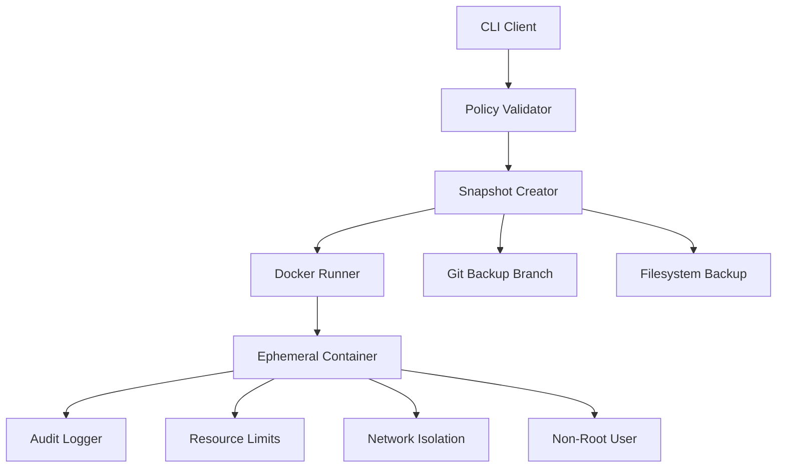
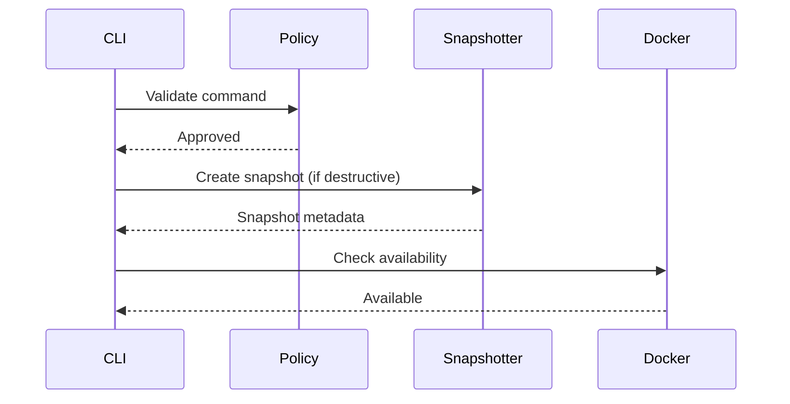
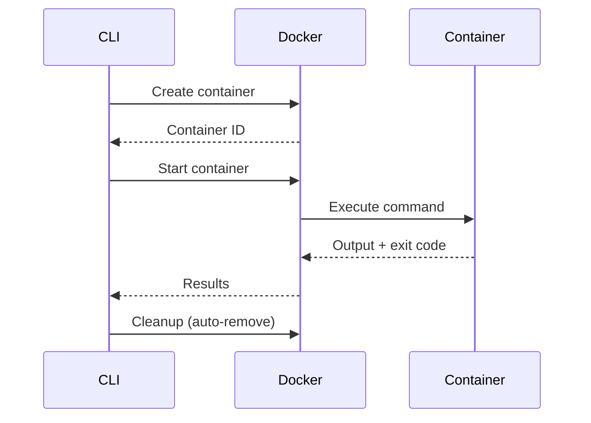
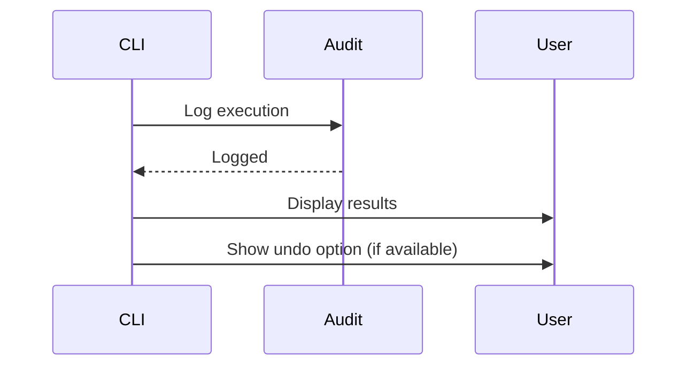

# Sandbox Execution Architecture

## Overview

QuickCMD uses Docker-based sandboxing to execute commands in isolated containers, providing a security boundary between untrusted commands and the host system.

## Architecture



## Docker Sandbox Configuration

### Default Settings

```go
SandboxOptions{
    Image:         "alpine:latest",    // Lightweight base image
    CPULimit:      0.5,                 // 0.5 CPU cores
    MemoryLimit:   256 * 1024 * 1024,  // 256 MB RAM
    PidsLimit:     64,                  // Max 64 processes
    NetworkAccess: false,               // No network by default
    ReadOnly:      false,               // Allow writes to workspace
    Timeout:       5 * time.Minute,    // 5 minute timeout
}
```

### Security Features

#### 1. Non-Root Execution

All commands run as UID 1000:1000 (non-root user):

```go
containerConfig.User = "1000:1000"
```

**Benefits:**
- Prevents privilege escalation
- Limits damage from container escapes
- Follows principle of least privilege

#### 2. Network Isolation

Network is disabled by default:

```go
hostConfig.NetworkMode = "none"
```

**Benefits:**
- Prevents data exfiltration
- Blocks malicious downloads
- Isolates from external services

**Enabling Network:**
```go
opts.NetworkAccess = true  // Use with caution
```

#### 3. Resource Limits

CPU, memory, and process limits prevent resource exhaustion:

```go
Resources: container.Resources{
    NanoCPUs: int64(0.5 * 1e9),  // 0.5 cores
    Memory:   256 * 1024 * 1024,  // 256 MB
    PidsLimit: &64,               // 64 processes
}
```

**Benefits:**
- Prevents fork bombs
- Limits memory consumption
- Prevents CPU starvation

#### 4. Execution Timeout

Commands are killed after timeout:

```go
ctx, cancel := context.WithTimeout(context.Background(), 5*time.Minute)
```

**Benefits:**
- Prevents infinite loops
- Limits resource usage
- Ensures responsiveness

#### 5. Automatic Cleanup

Containers are automatically removed after execution:

```go
hostConfig.AutoRemove = true
```

**Benefits:**
- No disk space waste
- Clean environment for each run
- Prevents container accumulation

## Volume Mounts

### Working Directory Mount

By default, the current working directory is mounted:

```go
Mounts: []Mount{
    {
        Source:   workingDir,
        Target:   "/workspace",
        ReadOnly: false,
    },
}
```

### Read-Only Mounts

For safe operations, use read-only mounts:

```go
Mount{
    Source:   "/path/to/data",
    Target:   "/data",
    ReadOnly: true,
}
```

## Pre-Run Snapshots

QuickCMD creates snapshots before destructive operations to enable undo.

### Git Snapshots

For Git repositories, a backup branch is created:

```bash
git branch quickcmd/backup/20250107-093000
```

**Restore:**
```bash
git checkout quickcmd/backup/20250107-093000
```

### Filesystem Snapshots

For non-Git directories, files are copied to a backup location:

```
/tmp/quickcmd/backups/snapshot-20250107-093000/
```

**Restore:**
```bash
cp -r /tmp/quickcmd/backups/snapshot-20250107-093000/* ./
```

## Execution Flow

### 1. Pre-Execution



### 2. Execution



### 3. Post-Execution



## Fallback Behavior

### Docker Not Available

When Docker is not installed or not running:

```
❌ Docker is not available

Docker is required for sandbox execution.
Please install Docker: https://docs.docker.com/get-docker/

Falling back to dry-run mode.
```

The command is NOT executed, and the user is shown installation instructions.

### Image Pull

If the Docker image doesn't exist locally, it's automatically pulled:

```go
reader, err := dr.client.ImagePull(ctx, image, types.ImagePullOptions{})
```

First execution may take longer while the image downloads.

## Security Boundaries

### What Sandbox Protects Against

✅ **Protected:**
- Accidental file deletion
- Resource exhaustion (CPU, memory, processes)
- Network-based attacks
- Privilege escalation (runs as non-root)
- Infinite loops (timeout)

### What Sandbox Does NOT Protect Against

❌ **Not Protected:**
- Container escape vulnerabilities (rare but possible)
- Kernel exploits
- Intentional malicious use by authorized users
- Side-channel attacks

## Performance Considerations

### Overhead

- **Container creation:** ~1-2 seconds
- **Image pull (first time):** ~10-30 seconds (alpine:latest)
- **Execution:** Minimal overhead (<100ms)
- **Cleanup:** Automatic, no overhead

### Optimization Tips

1. **Use lightweight images:** `alpine:latest` (5 MB) vs `ubuntu:latest` (77 MB)
2. **Pre-pull images:** `docker pull alpine:latest`
3. **Limit mounts:** Only mount necessary directories
4. **Adjust timeouts:** Shorter timeouts for quick commands

## Troubleshooting

### Docker Daemon Not Running

**Error:**
```
failed to create Docker client: Cannot connect to the Docker daemon
```

**Solution:**
- **Windows/macOS:** Start Docker Desktop
- **Linux:** `sudo systemctl start docker`

### Permission Denied

**Error:**
```
permission denied while trying to connect to the Docker daemon socket
```

**Solution:**
```bash
# Add user to docker group (Linux)
sudo usermod -aG docker $USER
newgrp docker
```

### Container Timeout

**Error:**
```
execution timeout after 5m0s
```

**Solution:**
- Increase timeout in sandbox options
- Optimize the command
- Check for infinite loops

### Out of Memory

**Error:**
```
container killed due to memory limit
```

**Solution:**
- Increase memory limit
- Optimize command memory usage
- Process data in chunks

## Advanced Configuration

### Custom Docker Image

Use a custom image with pre-installed tools:

```go
opts.Image = "myorg/quickcmd-tools:latest"
```

### Network Access

Enable network for specific commands:

```go
opts.NetworkAccess = true
```

⚠️ **Warning:** Only enable for trusted commands.

### Increased Resources

For resource-intensive operations:

```go
opts.CPULimit = 2.0              // 2 CPU cores
opts.MemoryLimit = 1024 * 1024 * 1024  // 1 GB
opts.Timeout = 30 * time.Minute  // 30 minutes
```

### Read-Only Filesystem

For maximum safety:

```go
opts.ReadOnly = true
```

Commands cannot modify the filesystem.

## Best Practices

1. **Always use sandbox mode** for untrusted commands
2. **Review commands** before execution, even in sandbox
3. **Test in sandbox first** before direct execution
4. **Monitor resource usage** for long-running commands
5. **Keep Docker updated** for latest security patches
6. **Use minimal images** to reduce attack surface
7. **Disable network** unless absolutely necessary
8. **Set appropriate timeouts** to prevent runaway processes

## Future Enhancements

- **Multi-container orchestration** for complex workflows
- **Custom seccomp profiles** for additional syscall filtering
- **AppArmor/SELinux profiles** for mandatory access control
- **Rootless containers** for additional isolation
- **Remote execution** via Docker contexts
- **GPU support** for ML/AI workloads

---

**Remember: Sandboxing provides defense-in-depth, but is not a complete security boundary. Always review commands before execution.**
